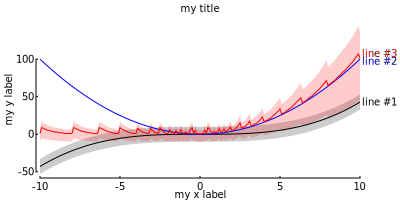
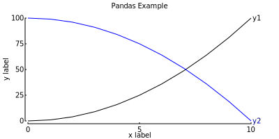
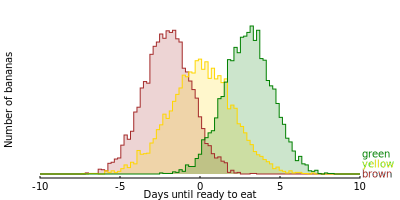

Examples
=======================================

First example
-------------

.. literalinclude:: ../examples/first_example.py

Displaying error patches
------------------------

The following demonstrates how to display error patches with output from a
typical SQL query. (You can see the query that generated the data using an open
data set available through the `Bigquery`_ console.)

.. _Bigquery: https://console.cloud.google.com/marketplace/product/sportradar-public-data/mlb-pitch-by-pitch
.. literalinclude:: ../examples/error_patch_example.py

    error_patch_example.svg

Displaying data in a Pandas dataFrame
-------------------------------------

.. literalinclude:: ../examples/pandas_example.py

    pandas_example.svg

Displaying time series data in a Pandas dataFrame
-------------------------------------------------

.. literalinclude:: ../examples/time_example.py

..  figure:: ../examples/time_example.svg

    time_example.svg

Displaying histograms
---------------------

.. literalinclude:: ../examples/hist_example.py

    hist_example.svg